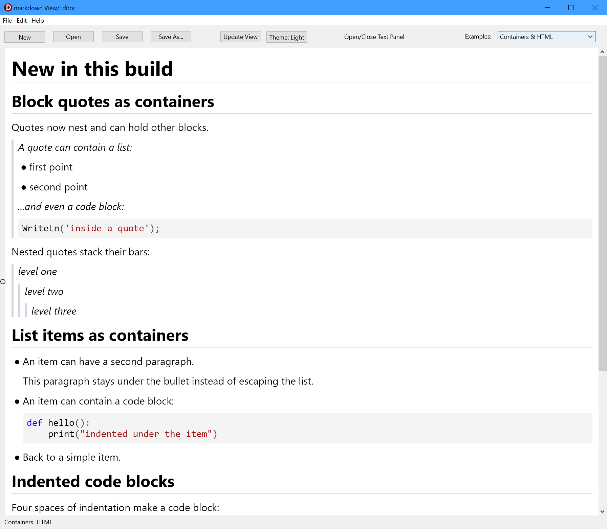

# Rho Markdown Viewer

A Skia-backed markdown viewer component for **FMX / Delphi 13 (RAD Studio 37.0)**.

The project was inspired by the VCL Markdown project from Alister Christie:

https://github.com/alisterchristie/NativeMarkdownViewer

This project was described on his YouTube Delphi channel:

https://www.youtube.com/@codegearguru

`TRhoMarkdownViewer` is a custom FireMonkey control that renders markdown
directly to a Skia canvas. It does **not** use a WebView, HTML, or an embedded
browser, and it installs into the IDE as a designable component on the
**`Rhody Controls`** palette page (or can be created entirely at runtime).

Because rendering goes through Skia (`ISkParagraph` / `ISkCanvas`) rather than
the platform text engine, it draws **identically on Windows and macOS**.

This is a from-scratch FMX/Skia rewrite of the VCL/GDI **Kai Markdown Viewer** —
the non-visual parser, highlighter, and HTML layers were ported verbatim, and the
entire visual layer (layout, paint, hit-testing, selection) was rebuilt on Skia.
See [Differences from the VCL original](#differences-from-the-vcl-original).

<p align="center">
  
</p>

<p align="center">
  <em>The <code>MDViewerEditor</code> demo with the text panel closed, rendering
  the &ldquo;Containers &amp; HTML&rdquo; sample: nested quote bars, list items
  holding their own paragraphs and code blocks, and per-language syntax
  colouring.</em>
</p>

---

## Contents

- `Source/uRhoMarkdownViewer.pas` — the control (`TRhoMarkdownViewer`)
- `Source/uRhoMarkdownTypes.pas` — block, inline-token, and source-map model types
- `Source/uRhoMarkdownParser.pas` — markdown-to-block parsing
- `Source/uRhoMarkdownHighlight.pas` — pluggable code-block syntax highlighters and their registry
- `Source/uRhoMarkdownHtml.pas` — HTML export helpers
- `Source/uRhoMarkdownMath.pas` — optional LaTeX math engine binding (see [Math](#math-latex))
- `Source/uRhoMarkdownViewerReg.pas` — design-time `Register`
- `Packages/RhoMarkdownViewer.dpk` — runtime package
- `Packages/dclRhoMarkdownViewer.dpk` — design-time package
- `Demo/` — headless-friendly sample project, the `sample.md` rendering corpus, and `math.md`
- `MDViewerEditor/` — a live side-by-side editor + preview demo
- `Tools/MarkdownRender/` — a headless tool that renders a markdown file to a PNG
- `Tests/` — a console DUnitX test suite for the non-visual layer

---

## Features

Supported rendering includes:

- Headings (`#` style and `===` / `---` setext underlines), with optional closing sequences (`## Heading ##`)
- Underline rule beneath H1/H2 headings, with an independent, disableable colour (`HeadingRuleColor`; `TAlphaColors.Null` to switch it off)
- Paragraphs
- Bold and italic spans
- Strikethrough spans
- Nested inline formatting (e.g. bold containing italic, or styled link text)
- Hard line breaks from two trailing spaces or a trailing backslash
- Escaped markdown punctuation
- HTML entities (named, decimal, and hex)
- Automatic links (`http://`, `https://`, `www.`)
- Angle-bracket URL and email autolinks
- Reference-style links — full `[text][ref]`, collapsed `[ref][]`, and shortcut `[ref]`
- Inline code
- Fenced code blocks — backtick or tilde (`~~~`) fences, of any length, so a block can itself contain a fence
- **Indented code blocks** (four-space, no fence)
- Syntax highlighting of fenced code blocks for 25+ languages (configurable via `SyntaxColors`)
- **LaTeX math** — `$x^2$` inline, `$$…$$` blocks, and code fences tagged `math`, typeset natively (optional; see [Math](#math-latex))
- Block quotes — **including nested quotes and quotes that contain lists, headings, and code blocks**
- Horizontal rules
- Ordered and unordered lists — both GFM ordered delimiters, `1.` and `1)`
- Nested list indentation
- **Multi-paragraph list items and code blocks nested inside a list item**
- Task lists with checked and unchecked boxes
- Clickable task checkboxes that toggle the source (`AllowTaskToggle`)
- Pipe tables with left, center, and right alignment, and escaped pipes (`\|`) as cell content
- Inline formatting and links inside table cells
- Images — **block and true inline**, scaled with alt-text fallback
- **Image alignment** — document-wide (`ImageAlign`), per image (``), or by an enclosing alignment container
- **A whitelist of inline HTML** — formatting tags plus `` with explicit sizing
- **`<p align="center">` / `<div align="center">` blocks** — the GitHub idiom for centring content, rendered as an alignment container
- **YAML front matter** rendered as a metadata card (`name:`/`description:` etc., as in `skill.md` and Jekyll-style documents)
- Clickable markdown links (`OnLinkClick`, or the system browser by default)
- **In-page anchor links** (`[text](#heading)`) with GitHub-compatible slugs, plus `ScrollToAnchor` for programmatic navigation and tables of contents
- Highlight spans using double equals (`==highlighted==`)
- Superscript (`^sup^`) and subscript (`~sub~`) with true raised/lowered baselines
- Common emoji shortcode parsing (e.g. `:smile:`, `:warning:`) with a colour-emoji font fallback
- **Light and dark themes** in one call (`ApplyTheme`)
- Vertical scrolling (wheel, scrollbar, keyboard, and edge auto-scroll while selecting)
- Mouse text selection across blocks, and `Ctrl/Cmd+A` to select all
- Copy the selection as the original markdown (`Ctrl/Cmd+C`) or as plain text (`Ctrl/Cmd+Shift+C`)
- **Find / search** with live highlighting, a current-match colour, match counting, and `F3` / `Shift+F3` navigation
- Read the current selection as markdown or plain text via `SelectedText`
- Floating clipboard **Copy** button when hovering a code block (`ShowCodeCopyButton`)
- Configurable body and code fonts (`FontFamily`, `CodeFontFamily`), font size, and content padding
- `OnScroll` for synchronising an external editor or scrollbar
- HTML export (`AsHtml`, `AsHtmlDocument`)
- Headless layout and rendering (`MeasureDocument`, `RenderToCanvas`) for offscreen/print/image use

### Inline syntax examples

Strikethrough uses double tildes, highlight uses double equals, and super/sub use
carets and tildes:

```markdown
This is ~~no longer current~~ and this is ==highlighted==.
Here is a formula: E = mc^2^, and water is H~2~O.
```

Emoji shortcodes are parsed automatically:

```markdown
This is a success :check: and a warning :warning:.
```

Inline emphasis nests, and link text can be formatted:

```markdown
This is **bold with _italic_ inside**, and a [**bold link**](https://example.com/).
```

End a line with two spaces or a backslash to force a hard line break, and prefix
punctuation with a backslash to render it literally:

```markdown
First line.<two spaces>
Second line, same paragraph.

\*not italic\* and \[not a link\]
```

A line of text underlined with `=` or `-` becomes a heading; HTML entities decode;
and URLs are linked automatically:

```markdown
Title becomes an H1
===================

&copy; 2024 &mdash; 100&nbsp;&times;&nbsp;200
https://www.embarcadero.com/  <support@example.com>
```

Reference-style links resolve from definitions in the document:

```markdown
Read the [DocWiki][docwiki].

[docwiki]: https://docwiki.embarcadero.com/
```

Tables support the alignment row and inline markdown inside cells:

```markdown
| Name        | Status  | Align Center | Align Right |
| :---        | :---    | :---:        | ---:        |
| **Current** | `active`| centered     | $100.00     |
| ~~Retired~~ | plain   | text         | $2.50       |
```

### Nested containers

Block quotes are container blocks: they nest, and they can hold any other block —
a list, a heading, or a fenced code block.

```markdown
> A quote can contain a list:
>
> - first point
> - second point
>
> ...and a code block:
>
> ```pascal
> WriteLn('inside a quote');
> ```

> level one
>> level two
>>> level three
```

List items are containers too. Content indented under the bullet and separated by
a blank line stays inside the item — a second paragraph, or a code block:

```markdown
- An item with a second paragraph.

  This paragraph stays under the bullet.

- An item with a code block:

  ```python
  def hello():
      print("indented under the item")
  ```
```

Four spaces of indentation (no fence) also make a code block:

```markdown
    procedure Indented;
    begin
      WriteLn('lines are preserved');
    end;
```

### Inline HTML whitelist

A small, safe subset of inline HTML is interpreted and mapped onto the same
inline styling the markdown syntax uses. **Everything else — attributed tags,
`<script>`, `<iframe>`, unknown tags — is left literal**, which is the safe
default for a viewer.

| Tags | Rendered as |
| :--- | :--- |
| `<b>` `<strong>` | bold |
| `<i>` `<em>` | italic |
| `<u>` `<ins>` | underline |
| `<s>` `<del>` `<strike>` | strikethrough |
| `<mark>` | highlight |
| `<sub>` / `<sup>` | subscript / superscript |
| `<code>` `<kbd>` | inline code (monospace) |
| `<br>` | line break |

```markdown
Water is H<sub>2</sub>O, press <kbd>Enter</kbd>, and <b>bold with <i>italic</i></b>.
```

`` is supported with `src`, `alt`, `width`, and `height`. Widths may be a
percentage of the content width or a pixel count, and — matching how GitHub
renders a README — a root-relative `src="/images/x.png"` resolves against
`BasePath`:

```markdown

```

> **Note:** the HTML whitelist affects on-screen rendering. `AsHtml` export
> currently escapes these tags rather than passing them through.

### Block alignment containers

One block-level HTML construct is interpreted, because it is the idiom a README
uses to centre content — markdown itself has no syntax for it:
`<p align="center">…</p>` and `<div align="center">…</div>` (also `left` and
`right`). The wrapper is consumed and its content is laid out with that
alignment, so the same file centres here and on GitHub.

```markdown
<p align="center">
  
</p>

<div align="right">
Right-aligned prose, and *inline markdown still works* inside the container.
</div>
```

Only a *recognised* `align` value makes a container: a bare `<div>`, an
unfamiliar alignment, or an unterminated wrapper keeps the documented default of
rendering literally, so arbitrary block HTML is never silently swallowed.

Images can also be aligned without any container. `ImageAlign`
(`riaLeft` — the default — `riaCenter`, `riaRight`) places every image in the
document, an `` attribute overrides it for one image, and an
enclosing alignment container wins over both:

```pascal
Viewer.ImageAlign := riaCenter;
```

### YAML front matter

A YAML front-matter header — a `---` block at the very top of the document,
closed by `---` or `...` — is rendered as a **metadata card**: a tinted panel with
each key in bold beside its value. This is what makes `skill.md`, Jekyll, and
Hugo-style documents display cleanly instead of turning the closing `---` into a
stray heading.

```markdown
---
name: delphi-fmx
description: "Specialist in FireMonkey (FMX) and Delphi mobile development."
model: opus
---

# The document body follows as normal.
```

Parsing is intentionally shallow — top-level `key: value` pairs, with indented or
colon-less lines folded into the preceding value and surrounding quotes stripped
— which covers typical headers without pulling in a full YAML engine.

---

## Basic usage

Add `uRhoMarkdownViewer` to your `uses` clause and create the control like any
other FMX control:

```pascal
uses
  uRhoMarkdownViewer;

var
  Viewer: TRhoMarkdownViewer;
begin
  Viewer := TRhoMarkdownViewer.Create(Self);
  Viewer.Parent := Self;
  Viewer.Align := TAlignLayout.Client;
  Viewer.MarkdownText := '# Hello' + sLineBreak + sLineBreak + 'This is **markdown**.';
end;
```

You can also assign lines directly, or load from a file:

```pascal
Viewer.Markdown.Assign(Memo1.Lines);

Viewer.LoadFromFile('README.md');   // reads UTF-8, sets BasePath automatically
```

`LoadFromFile` reads the file as UTF-8 (honouring a BOM when present) and sets
`BasePath` to the file's folder, so relative image paths resolve. You can also set
`BasePath` yourself:

```pascal
Viewer.BasePath := ExtractFilePath(Application.ExeName);
```

### Links and in-page anchors

By default, clicking a markdown link opens it with the system browser. To handle
links yourself, assign `OnLinkClick`:

```pascal
Viewer.OnLinkClick :=
  procedure(Sender: TObject; const AUrl: string)
  begin
    ShowMessage(AUrl);
  end;
```

**In-page anchor links work out of the box.** A link whose target begins with `#`
scrolls to the heading whose GitHub-style slug matches, so tables of contents in
a README behave as they do on GitHub:

```markdown
See [Differences from the original](#differences-from-the-vcl-original).
```

You can also jump programmatically, and build a table of contents using the same
slug rule the viewer resolves against:

```pascal
if not Viewer.ScrollToAnchor('installation') then
  ShowMessage('no such heading');

Anchor := RhoHeadingSlug('Getting Started');   // -> 'getting-started'
```

Slugs follow GitHub's rule — lower-cased, punctuation dropped, spaces turned into
hyphens — computed from the *rendered* heading text, so inline markup in a
heading does not leak into the anchor. Repeated headings disambiguate as
`slug`, `slug-1`, `slug-2`.

> **Note:** if you assign `OnLinkClick`, your handler receives anchor links too,
> and internal navigation no longer happens automatically — call
> `ScrollToAnchor(AUrl)` from your handler when the target starts with `#`.

### Task checkboxes

Task list checkboxes render in every document. Set `AllowTaskToggle := True` to
make them clickable — a click flips `[ ]` / `[x]` in the underlying markdown
source and fires `OnTaskToggle`:

```pascal
Viewer.AllowTaskToggle := True;
Viewer.OnTaskToggle :=
  procedure(Sender: TObject; const AText: string; AChecked: Boolean)
  begin
    // Viewer.MarkdownText has already been updated; mirror it wherever you like.
  end;
```

---

## Find and search

The component owns the search **mechanism** — matching, highlighting, and
scrolling a hit into view — and the host owns the find **bar**. Highlighting
needs the laid-out paragraphs, which are not reachable from outside; the UI, by
contrast, needs no privileged access, so baking one in would only fight the
host's styling. (The same reasoning as `ApplyTheme` being a method.)

```pascal
Viewer.SearchCaseSensitive := False;
Viewer.SearchWholeWords    := False;
Viewer.SearchText          := EditFind.Text;   // highlights; does not scroll
Viewer.FindNext;                               // moves to the next match

LabelCount.Text := Format('%d of %d',
  [Viewer.SearchMatchIndex + 1, Viewer.SearchMatchCount]);
```

API: `SearchText`, `SearchCaseSensitive`, `SearchWholeWords`,
`SearchHighlightColor`, `SearchCurrentMatchColor` (all published),
`SearchMatchCount` / `SearchMatchIndex` (public, read-only), `FindNext`,
`FindPrevious`, `ClearSearch`, and the `OnSearchChange` event — which is what a
find bar drives its `n of m` counter from. `F3` and `Shift+F3` step through
matches while a search is active.

Two deliberate behaviours worth knowing:

- **Assigning `SearchText` highlights but does not scroll.** An incremental find
  bar assigns on every keystroke, and yanking the view each time is unusable —
  the host calls `FindNext` to move.
- **Matching runs over the rendered text, not the markdown source**, so a search
  never matches `**` around a bold word, a link URL, or an entity name the
  reader cannot see. It is also **within a block**: a phrase spanning a
  paragraph break is not found.

`MDViewerEditor` has a working find bar (**Edit ▸ Find…**, `Ctrl+F`) as the
reference example of the host's half.

---

## Theming and colours

`ApplyTheme` sets every colour surface — including the code-syntax palette — from
one curated theme in a single call:

```pascal
Viewer.ApplyTheme(rtDark);   // or rtLight
```

Theming is a **method, not a published property**, deliberately: a published
`Theme` would re-apply on `.fmx` load and clobber colours a host had set by hand.
Every colour stays individually overridable afterwards. All colours are
`TAlphaColor`:

```pascal
Viewer.BackgroundColor := TAlphaColors.White;
Viewer.LinkColor       := TAlphaColors.Deepskyblue;
Viewer.HeadingRuleColor := TAlphaColors.Null;   // hide the H1/H2 underline rule
```

Individual colour surfaces: `BackgroundColor`, `TextColor`, `LinkColor`,
`CodeBackgroundColor`, `QuoteBarColor`, `RuleColor`, `HeadingRuleColor`,
`HighlightColor`, and `SelectionColor`.

---

## Syntax highlighting

Fenced code blocks are highlighted when the opening fence carries a language tag,
matched case-insensitively against a registry of built-in highlighters:

````markdown
```pascal
procedure Hello;
begin
  WriteLn('Hi');   // greet
end;
```
````

Built-in languages (with the fence tags that select them):

| Language | Tags |
| :--- | :--- |
| Delphi / Object Pascal | `pascal`, `objectpascal`, `objpas`, `delphi`, `pas`, `dpr`, `dpk`, `pp`, `lpr` |
| Delphi form file | `dfm` |
| Antimony (SBML model language) | `antimony`, `ant`, `sb` |
| C / C++ / C# | `c`; `cpp`, `c++`, `cxx`, `cc`, `hpp`; `cs`, `csharp`, `c#` |
| Java / JavaScript / TypeScript | `java`; `js`, `javascript`; `ts`, `typescript` |
| Go / Rust / PHP | `go`; `rs`, `rust`; `php` |
| Python / Ruby | `py`, `python`; `rb`, `ruby` |
| SQL | `sql` |
| HTML / XML / CSS | `html`, `htm`; `xml`; `css` |
| JSON / YAML | `json`; `yaml`, `yml` |
| Shell / INI | `sh`, `bash`, `shell`; `ini`, `cfg`, `conf` |

Token colours are exposed through the `SyntaxColors` property, which is an
expandable node in the Object Inspector (it is a `TPersistent` and streams into
the `.fmx`). Each token kind has a colour: `PlainColor`, `KeywordColor`,
`CommentColor`, `StringColor`, `NumberColor`, `TypeColor`, `PreprocessorColor`,
`SymbolColor`.

```pascal
Viewer.SyntaxColors.KeywordColor := TAlphaColors.Navy;
```

A colour defaults to `TAlphaColors.Null`, meaning "unset — follow the viewer's
`TextColor`", so an untouched palette follows the theme while an explicit colour
always wins. `ApplyTheme` retunes the whole palette for light or dark.

An unrecognised or missing language tag falls back to plain, unhighlighted code.
Additional languages can be registered at runtime with
`TMarkdownSyntaxHighlighterRegistry.RegisterHighlighter`.

---

## Images

Images use standard markdown syntax, and render both as their own block and
**inline** within a paragraph:

```markdown


An icon  sits right in the text flow.
```

Local paths resolve against `BasePath` (set automatically by `LoadFromFile`).
Images scale down to the content width and are never upscaled — **unless** an
HTML `` requests an explicit size, which is honoured (and may
upscale, clamped to the content width). Missing, unreadable, and remote images
fall back to italic alt text; remote URLs are deliberately never fetched, so
layout never performs network I/O.

---

## Math (LaTeX)

Formulas are typeset natively — no WebView, no MathJax, no browser:

````markdown
The roots of $ax^2+bx+c=0$ are given by

$$
\frac{-b \pm \sqrt{b^2-4ac}}{2a}
$$

```math
\sum_{i=1}^{n} i = \frac{n(n+1)}{2}
```
````

`$…$` is inline, `$$…$$` is display style (either inside a paragraph or as its
own block), and a code fence tagged `math` is display math — GitHub's own
spelling. Inline formulas sit on the text baseline; display blocks are centred.

### It is optional, and it degrades

Math is a specialist need, so **an application that does not want it deploys
nothing extra and pays nothing**. The engine is loaded dynamically at first use,
never linked. When it is absent — or `MathEnabled` is `False`, or the LaTeX does
not parse — the formula renders as **its literal LaTeX source**, styled as code.
Nothing is ever swallowed, and a document containing math still reads sensibly.

To enable it, deploy beside the executable:

| | |
| :--- | :--- |
| Windows | `ratex_ffi.dll` |
| macOS | `libratex_ffi.dylib` |
| both | `fonts\KaTeX_*.ttf` — all 20 faces |

Both locations can be overridden, and availability queried:

```pascal
RhoSetMathLibraryPath('C:\MyApp\lib\ratex_ffi.dll');
RhoSetMathFontDir('C:\MyApp\fonts');
if not RhoMathAvailable then
  ShowMessage(RhoMathLastError);
```

### Getting the binaries

The **math support bundle** on this project's
[Releases](../../releases) page contains everything above — the library for
Windows and macOS, all 20 fonts, and the licence files — ready to unzip beside
your executable. It is a separate download on purpose: an application that does
not want math never fetches it.

To build the library yourself instead, you need only the FFI crate of
[RaTeX](https://github.com/erweixin/RaTeX):

```
git clone https://github.com/erweixin/RaTeX
cd RaTeX
cargo build --release -p ratex-ffi                                # Windows  -> target\release\ratex_ffi.dll
cargo build --release -p ratex-ffi --target aarch64-apple-darwin  # macOS    -> libratex_ffi.dylib
```

The fonts are the `KaTeX_*.ttf` files in that repository's `fonts/` folder.
Upstream RaTeX publishes releases for Android, iOS, Flutter, JVM, npm and a CLI,
but **not** a plain desktop library, which is why the bundle here exists.

**If you redistribute the bundle with your own application**, note that the two
halves are under different licences: RaTeX itself is MIT, but the KaTeX fonts
are under the **SIL Open Font License 1.1**. Keep `KaTeX-fonts-NOTICE.txt` and
`SIL-OFL-1.1.txt` (both included in the bundle, and both in RaTeX's `licenses/`
folder) with whatever you ship.

### How it works

The engine is [RaTeX](https://github.com/erweixin/RaTeX), a pure-Rust,
KaTeX-compatible layout engine. It returns a display list — positioned glyphs,
rules and paths in em units — which the viewer replays straight onto the Skia
canvas, so a formula stays vector at any size.

Laid-out formulas are cached in em units, so they are measured once per
document and survive every resize and repaint.

### Dollar signs in ordinary prose

`$` is common in prose, so a span becomes math only when it really looks like
one. None of these are touched:

```markdown
it costs $5 and $10, or US$100 and CA$200
an escaped \$x\$ stays literal, and `$x^2$` in a code span stays code
```

The rules: no whitespace immediately inside a delimiter, no opening `$` directly
after a letter or digit, no closing `$` directly before a digit, no backtick
inside a span, and no line break inside one. A `$$` block must be closed, or it
is left as ordinary text.

### Selection, copy and export

A formula copies as its LaTeX source, which is what you want to paste. HTML
export emits `$…$` / `$$…$$` wrapped in `<span class="math">` and
`<div class="math display">`, ready for a client-side KaTeX or MathJax; exported
HTML cannot carry the display list, so it is not typeset here.

---

## HTML export

The current document can be exported to HTML. `AsHtml` returns a fragment;
`AsHtmlDocument` wraps it in a complete page with an optional title:

```pascal
Fragment := Viewer.AsHtml;
Page     := Viewer.AsHtmlDocument('My Notes');
```

The conversion is also available without a control through `MarkdownToHtml` /
`MarkdownToHtmlDocument` in `uRhoMarkdownHtml`.

---

## Headless rendering

`MeasureDocument` lays the document out at a given width and returns its full
height, and `RenderToCanvas` paints it to any `ISkCanvas` — neither needs the
control to be parented or shown. This drives `Tools/MarkdownRender`, which renders
a markdown file straight to a PNG through the real layout and paint path:

```text
MarkdownRender.exe input.md output.png [width] [fontSize] [links|select|html|anchors|search <term>] [dark] [center|right]
```

---

## Keyboard navigation

When the viewer has focus (macOS uses ⌘ in place of Ctrl):

- Up / Down arrows
- Page Up / Page Down
- Home / End
- Space / Shift+Space
- Ctrl/Cmd+A — select all
- Ctrl/Cmd+C — copy the selection as markdown
- Ctrl/Cmd+Shift+C — copy the selection as plain text
- F3 / Shift+F3 — next / previous search match (while a search is active)
- Escape — clear the selection

---

## Demo application

`MDViewerEditor/MarkDownViewerEditorProject.dproj` is a live side-by-side editor:
a `TMemo` on the left and a `TRhoMarkdownViewer` on the right. It demonstrates
two-way scroll synchronisation (via `OnScroll`), clickable task checkboxes
mirrored back into the editor (`AllowTaskToggle` + `OnTaskToggle`), drag-and-drop
of a `.md` file onto the preview, and a set of sample documents — including one
that showcases the container-block and inline-HTML features.

It also doubles as a small markdown editor: **Open**, **Save** and **Save As**
on the toolbar, a **Find** bar (**Edit ▸ Find…**, `Ctrl+F`) wired to the
viewer's search API, and a toggle that hides the editor pane so the preview
fills the window.

`Demo/sample.md` is the rendering corpus: a single document that exercises every
implemented feature, and the closest thing to a visual regression suite.

---

## Differences from the VCL original

This port matches the VCL predecessor's markdown coverage and then goes beyond it,
but a few interactive features from the original are intentionally **not** part of
this version.

**Ahead of the original:**

- Skia rendering — identical output on Windows and macOS
- Light and dark themes (`ApplyTheme`)
- Designable, streamable `SyntaxColors`
- Nested container blocks: nested quotes, list-in-quote, quotes holding any block, multi-paragraph list items, and code blocks inside list items
- Indented (four-space) code blocks
- An inline HTML whitelist, including `` with explicit sizing
- `<p align>` / `<div align>` alignment containers and a document-wide `ImageAlign`
- True inline images (not just block images)
- True super/subscript baselines
- Emoji / symbol colour-font fallback
- The Antimony syntax highlighter
- A headless render-to-image tool

**Not in this version (present in the VCL original):**

- In-place editing of the rendered source (`ReadOnly := False`), undo/redo, caret
  navigation, and the associated editing shortcuts — this viewer is **read-only**.
- Incremental streaming (`AppendMarkdownText`): the whole document is reparsed on
  every change.

---

## Building

Delphi 13 = RAD Studio **37.0**. Source `rsvars.bat` before `msbuild` so it can
find the Delphi targets.

**Packages** (Win32 — the design package must match the 32-bit IDE, and the
runtime package must match the design package; build the runtime one first):

```bat
call "C:\Program Files (x86)\Embarcadero\Studio\37.0\bin\rsvars.bat"
msbuild Packages\RhoMarkdownViewer.dproj    /t:Build /p:Config=Debug /p:Platform=Win32
msbuild Packages\dclRhoMarkdownViewer.dproj /t:Build /p:Config=Debug /p:Platform=Win32
```

Applications link the component's units statically through the search path, so an
app can be **Win64** even though the packages are Win32.

**Editor demo** (Win64):

```bat
msbuild MDViewerEditor\MarkDownViewerEditorProject.dproj /t:Build /p:Config=Debug /p:Platform=Win64
```

---

## Tests

`Tests/RhoMarkdownTests.dpr` is a console DUnitX runner covering the model,
parser, highlighter, and HTML layers — no FMX or Skia dependency, so the
non-visual layer stays testable without a UI.

```bat
msbuild Tests\RhoMarkdownTests.dproj /t:Build /p:Config=Debug /p:Platform=Win64
Tests\RhoMarkdownTests.exe --exitbehavior:Continue
```

---

## Markdown coverage — what is *not* supported

This is a practical markdown renderer, not a conformant CommonMark
implementation. Everything listed under [Features](#features) works; the list
below is an inventory of what does **not**, verified by rendering each
construct rather than inferred from the code. Unsupported syntax always degrades
to visible literal text — nothing is silently dropped.

| Construct | Example | Behaviour |
| :--- | :--- | :--- |
| Multi-backtick code spans | ``` ``code with ` inside`` ``` | Only single-backtick spans are parsed. |
| Angle-bracket link destinations | `[a](<url with spaces>)` | The destination is cut at the first space. |
| Footnotes | `[^1]` | GFM extension; renders literally. |
| HTML blocks | `<details>`, `<table>`, a bare `<div>` | Beyond the [inline HTML whitelist](#inline-html-whitelist) and the [`align` containers](#block-alignment-containers), block-level HTML renders literally. |
| Lazy block-quote continuation | a `>` line continued on the next line without `>` | The continuation escapes the quote. Prefix every line with `>`. |

Also out of scope, being neither CommonMark nor GFM: definition lists,
admonition/alert blocks (`> [!NOTE]`), and custom directives. **Math (`$…$`,
`$$…$$`, and a `math` fence) *is* supported** — see [Math](#math-latex) — as an
optional feature that falls back to showing the LaTeX source.

Nested containers *are* supported — nested block quotes, lists and code blocks
inside quotes, and multi-paragraph or code-bearing list items all render — as are
four-space indented code blocks, tilde and long code fences, and `align`
containers. Those were the historic gaps and are now closed.

It is intended for application help, notes, preview panes, and embedded
documentation, where native cross-platform rendering and simple deployment matter
more than exhaustive markdown compatibility.
